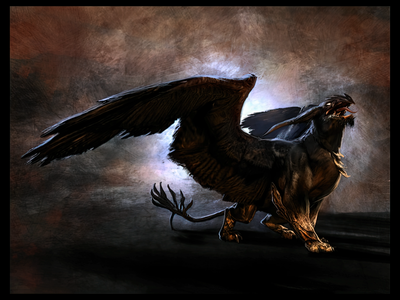
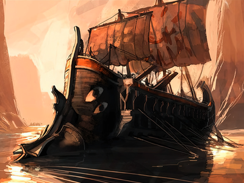
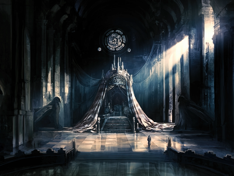
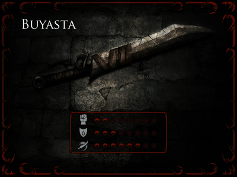
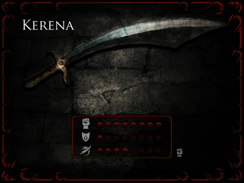
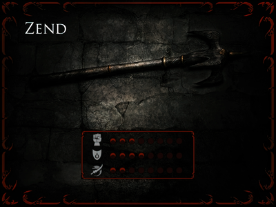

# Prince of Persia: Warrior Within

## Arts

### Characters

|  |  |  |  |  |
| :---------------------: | :---------------------: | :---------------------: | :---------------------: | :---------------------: |
|  |  |  |  |  |
|  |  |  |  |  |
|  |  |  |  |  |

### Environments

|  |  |  |  |  |
| :---------------------: | :---------------------: | :---------------------: | :---------------------: | :---------------------: |         
|  |  |  |  |  |
|  |  |  |  |  |
|  |  |  |  |  |
|  |  |  |  |  |
|  |  |  |  |  |

### Illustrations

|  |  |  |  |  |
| :---------------------: | :---------------------: | :---------------------: | :---------------------: | :---------------------: |
|  |  |  |  |  |
|  |  |  |  |  |

### Map

## Weapons

### Main

|  |  |  |  |  |
| :---------------------: | :---------------------: | :---------------------: | :---------------------: | :---------------------: |
|  |  |  |  |  |

### Swords

|  |  |  |  |  |
| :---------------------: | :---------------------: | :---------------------: | :---------------------: | :---------------------: |         
|  |  |  |  |  |
|  |  |  |  |  |
|  |  |  |  |  |

### Axes

|  |  |  |  |  |
| :---------------------: | :---------------------: | :---------------------: | :---------------------: | :---------------------: |         
|  |  |  |  |  |
|  |  |  |  |  |

### Maces

|  |  |  |  |  |
| :---------------------: | :---------------------: | :---------------------: | :---------------------: | :---------------------: |         
|  |  |  |  |  |

### Daggers

|  |  |  |  |  |
| :---------------------: | :---------------------: | :---------------------: | :---------------------: | :---------------------: |         
|  |  |  |  |  |

### Miscellaneous

|  |  |  |  |  |
| :---------------------: | :---------------------: | :---------------------: | :---------------------: | :---------------------: |
