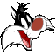

# Taz Wanted Cheat Codes
At the start screen **on 3rd save slot** select icon and type cheat, then press **Rant** button (not END) to activate (tasty sound) or deactivate (burp sound) cheat:

-  `*NO` - Deactivate All Cheats
-  `#OP` - All Levels
-  `!WB` - Disable Whack-in-the-Boxes
-  `.RT` - All Galleries
-  `*JC` - All 2-Player Boss Games
-  `?BN` - All Bonus Games
-  `?DW` - Digital Watch
-  `B!R` - Blue-Red Stereoscopic (Only for PC / PS2 / Xbox)
-  `R!B` - Red-Blue Stereoscopic (Only for PC / PS2 / Xbox)

## Character Icons Map
|  |  |  |  |  |
| :-----------------------: | :------------------------: | :------------------------: | :------------------------: | :----------------------: |
| **1** | **2** | **3** | **4** | **5** |
|  |  |  |  |  |
| Taz Shout | Taz Scared | Taz Tongue | Taz Growl | Taz Fast |
|   |   |   |   |    |
| **6** | **7** | **8** | **9** | **10** |
|  |  |  |  |  |
| Marvin the Martian | Porky Pig | Sylvester the Cat | Daffy Duck Mad | Daffy Duck Mean |
|   |   |   |   |    |
| **11** | **12** | **13** | **14** | **15** |
|  |  |  |  |  |
| Gossamer | Pepé Le Pew | Tweety | Speedy Gonzales | Granny |

## Rant Button
-  PlayStation 2 - **☐**
-  Xbox - **X**
-  PC - **D**
-  GameCube - **X**

## Hidden Button Combos
- `CameraLeft` + `CameraRight` + `L3` - Look at Watch (When Digital Watch cheat is active)
- Hold `L3` - Ignore wall sliding state
