# Taz Wanted Map Schemes
Extracted map images from development game versions. Left side - **unreleased**; right side - **released** versions:

## ❄️ Ice Burg
| 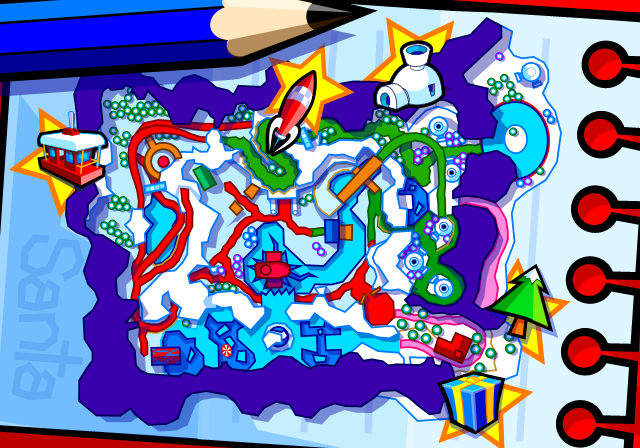		| 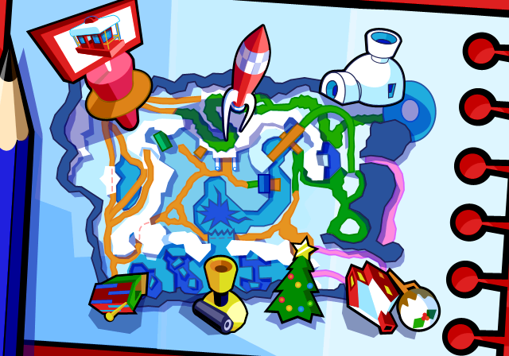		|
| :-: | :-: |

## 🐘 Zooney Tunes
| 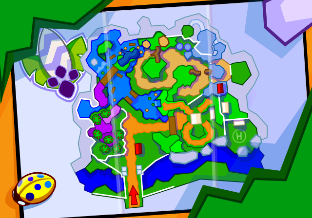		| 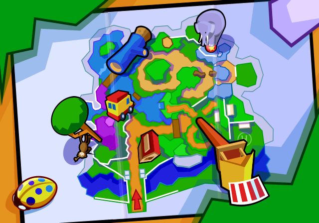		|
| :-: | :-: |

## 🛟 Looney Lagoon
| 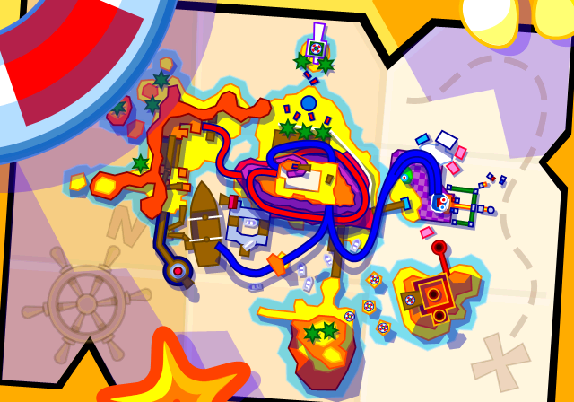		| 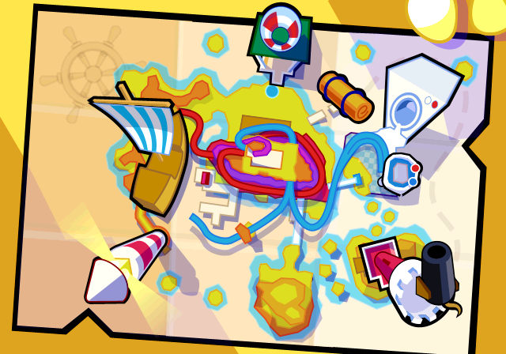		|
| :-: | :-: |

## 🛒 Looningdale's
| 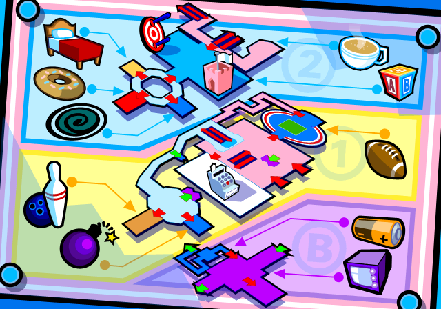		| 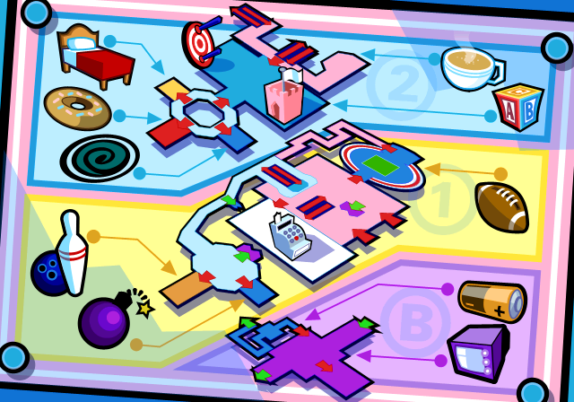		|
| :-: | :-: |

## 🏺 Samsonian Museum
| 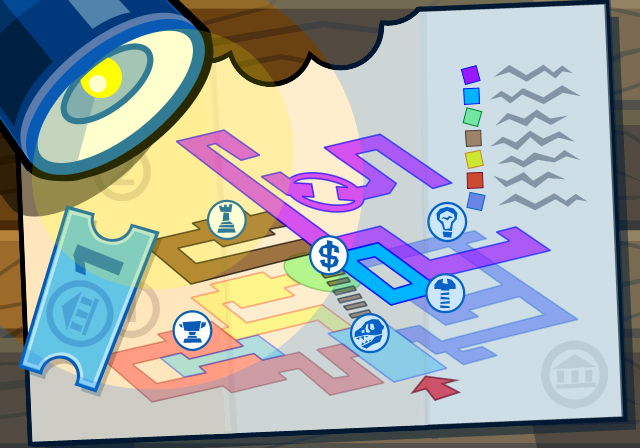		| 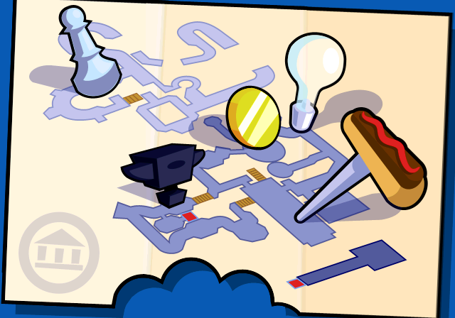		|
| :-: | :-: |

## 🏗 Bank of Samerica
| 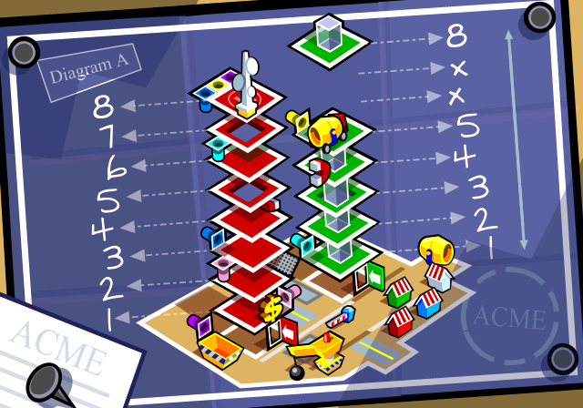	| 	|
| :-: | :-: |

## 🎃 Taz: Haunted
| 		| 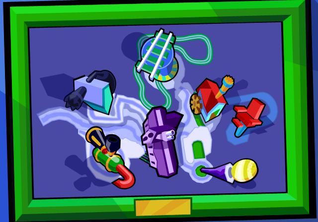		|
| :-: | :-: |

## ⚒️ Cartoon Strip-Mine
| 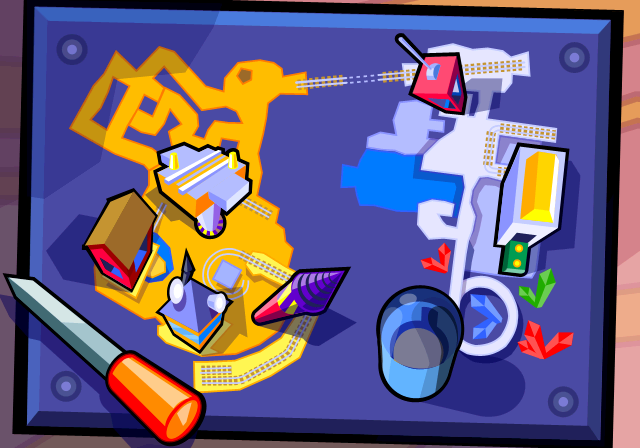	| 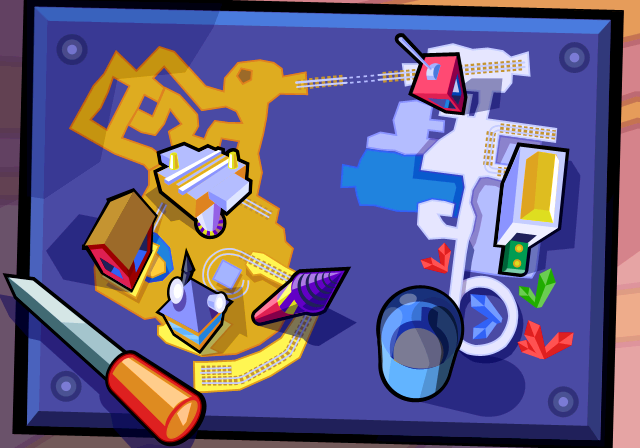	|
| :-: | :-: |

## 🌵 Granny Canyon
| 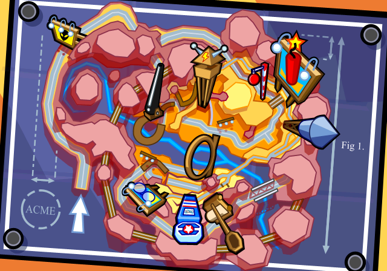		| 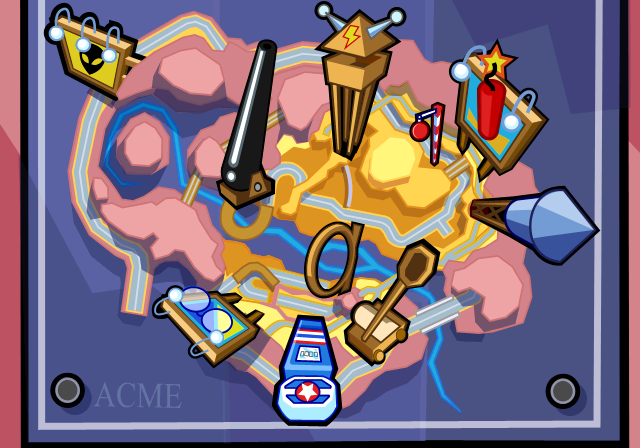		|
| :-: | :-: |

## 🌴 Tazland A-maze-ment Park
| 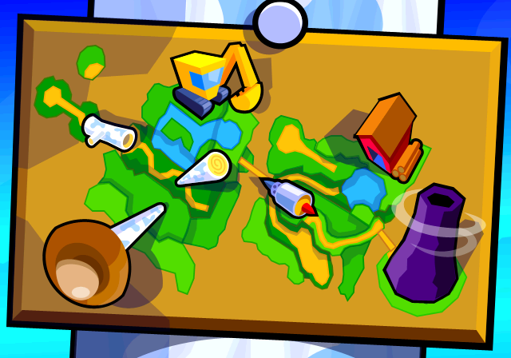		| 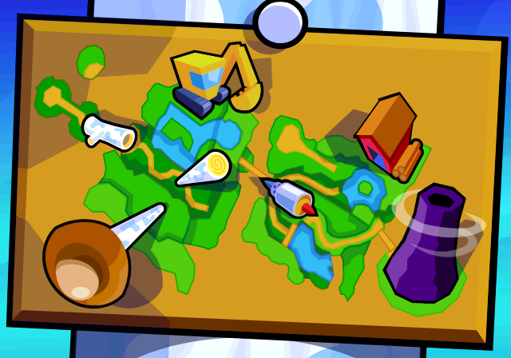		|
| :-: | :-: |
